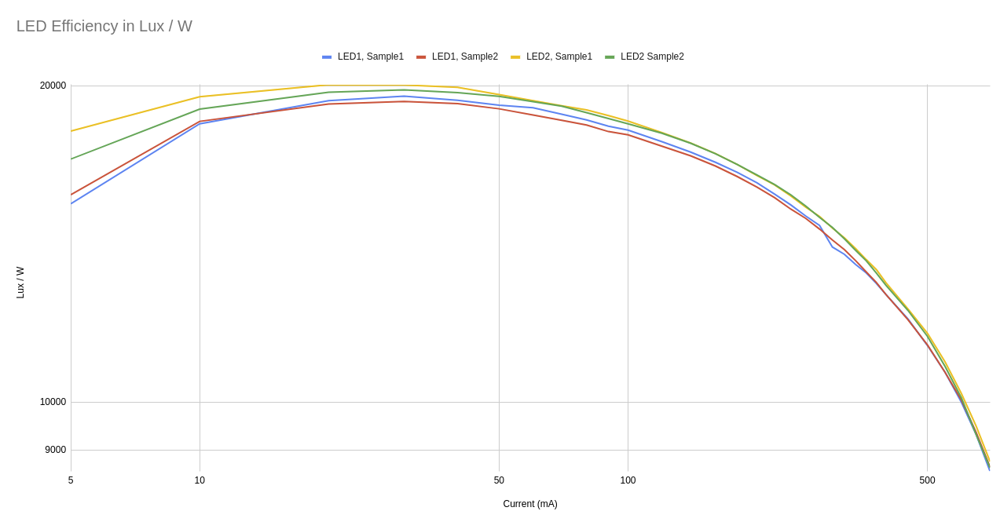
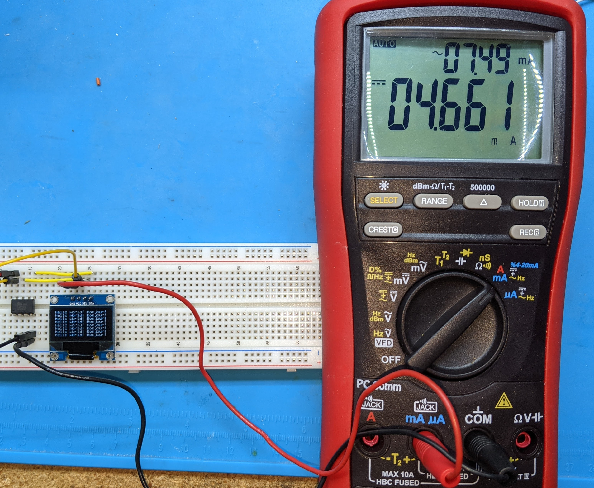
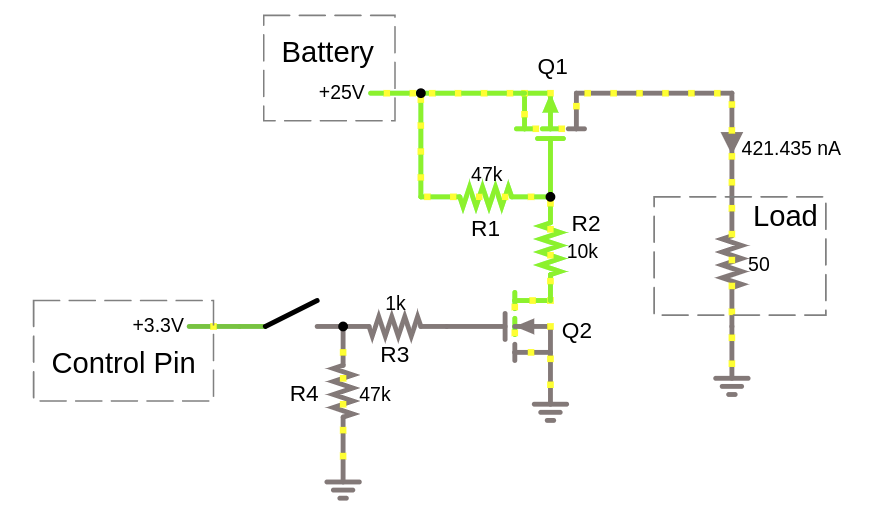

# Design Notes

## Measuring LED Efficiency

The question here is what current are the LEDs the most efficient at?  Do you
get more light running 1 LED at 1W or 2 LEDs at 0.5W each?
[This website](https://tehnoblog.org/smd-led-chips-characteristics-size-power-efficiency/)
has some good information but did not cover the specific LED I purchased.  So I
decided to do some testing with a light meter.  Here is the setup:

Inside the black lens hood is an LED.  The device measures the Lux detected on
it's sensor.  I ran different currents through the LED, noting the voltage
and lux 
[recording the measurements this spreadsheet](https://docs.google.com/spreadsheets/d/1-tIt16MrtUSSaDjhF26bp0V8y1RnZGNZchjPFLyIPXU/edit?usp=sharing).
I ran 2 led's 2 times for a total of 4 measurements.  From the data, I created two graphs:

This graph shows Lux/Watt (efficiency) at a given current for all collected
samples.  It is showing that the LED is most efficient at ~20-50mA where
efficiency starts to drop off.  Note that the LED *is still getting brighter* as
current increases, but more energy is being *given off as heat* instead of light.
**Thus one can roughly conclude that using as many LEDs as possible is the most
efficient** as long as you are using at least 40mA per LED.

Here is another way to look at the data:

This case looks at choosing 1-5 LEDs and how much light you would get for a
given power budget.  From the graph, it looks like gains start around 0.5W and
become interesting above 1W.  Adding additional LED's has diminishing
returns, although still interesting at higher power budgets.

# OLED Power Consumption

To measure current, I used an ATTiny85 as the driver because it was a
convenient way to test at 3.3V (provided with a bench power supply).  Since I'm
only measuring current through the OLED, the device is irrelevant anyway.

The test toggles between the DISPLAYON and DISPLAYOFF I2C command every 4
seconds.  I wanted to see the current draw difference and get some confidence
as to the reliability of the commands (which I have not used before)

Here is the ON measurement:

4.4 mA (15 mW) is not bad but more load than I would prefer when in the
"battery is depleted" shutoff state.  4.4 mA over 24h would be 104 mAh (post
buck) which could be a problem for an already-depleted smaller 2S pack.

With the DISPLAYOFF command:

5 uA, pretty much a non-issue from the OLED, even if a small depleted pack is
left connected for a long time.

The tests also suggested that toggling between DISPLAYON and DISPLAYOFF will
work reliably.

# INA260 Testing

I setup the INA260 in an isolated test where I compared the reported value to a
multimeter measured value.  

For voltage, I found the INA260 to be very accurate.

For current, I found that the current read 2 mA low on both of my devices. By
simply adding 2mA to the result, I was able to get numbers within 1mA of the
multimeter across a 0-60mA range of values.  Good enough.

I also tested current draw into the INA260 in acive and sleep modes.  I measured
322 uA of draw in active mode and only 660 nA in sleep mode.

# PicoBuck Testing

I wanted to see if sending a grounded PWM signal to the PicoBucks would lower power
usage to acceptable levels.

Just a bit under 1mA.  Since I'm using 3 of these, the total "off" draw would
be just under 3 mA.  I think this is a bit too high to leave connected to a
depleted battery, thus I decided use a transistor to cut power to the PicoBucks
while the light is off.

# Pro Mini Sleep Current 

I took a current measurement of the device after removing the
built in 3.3V regulator and diode (as recommended by
[various low power guides](https://www.the-diy-life.com/making-an-ultra-low-power-arduino-pro/)),
and putting the device into low power (sleep) mode.  I measured just under 20 uA,
which is higher than the guides suggest, but low enough for my project.

# Switch Design

I decided to go with a high side PFET solution of the following design:

Here are some notes on how the circuit works:

  * Q1 is the main component.  It is a Power P-Channel MOSFET.  I used the
    FQP27P06 but others could work.  As a PFET, it is "ON" when the gate voltage
    is pulled below the source.
  * R1 is a pullup resistor that turns off Q1 by default
  * R2 prevents the voltage from being pulled too low.  Every P-Channel MOSFET
    has a maximum rated Vgs that should not be exceeded and this rating will
    determine the correct ratio between R1 and R2.
  * Q2 pulls the gate of Q1 down.  Thus, when Q2 is on, Q1 is also on.  Q2 is
    needed to handle the voltage at the Q1 gate, which is too high to handle
    directly with a microcontroller.
  * R3 is used to dampen potential oscillations that can occur when switching
    Q2 on and off.
  * R4 pulls Q2 to ground by default, which means that the microcontroller does
    not need to actively drive that connection for the light to be off.  This
    provides stability while the microcontroller is starting up and is a good
    general default mode.

### N-Channel MOSFET?

Many designs go with an N-Channel MOSFET, which might require fewer components.
This "lowside" solution creates the concept of 2 independent grounds because
the PicoBuck ground would be on the high side of the MOSFET.  The PicoBuck
supports separate grounds for logic and power but now the total number of wires
to the PicoBucks is 4 (Power, Power Ground, PWM, PWM Ground) instead of 3,
something to consider if you want to modularize the design.

A bigger issue is that 3.3V doesn't fully saturate most N-Channel MOSFETs, which
will limit the current to some peak value that varies by MOSFET.  To Overcome
this, we would either need to switch to 5V logic (which uses more power), or
add an additional transistor to allow a higher Vgs (which negates the
simplicity).

### Darlington NPN?

This low side solution should work fine and would be a fairly simple circuit.
There will be a bit of power lost at the Vbe junction and current limiting
resistor when the circuit is on but it could be argued as acceptable.  A
reasonable alternative with the same "2 grounds" downside as the N-Channel
MOSFET.

### Relay?

The main benefit of a relay is *potential* full isolation between logic and
power.  This is not needed or usable here, since the same battery powers the
logic and LEDs.  Downsides differ between mechanical and solid state.  For
mechanical, managing the coil is a downside.  Solid state could be fine but
check the datasheet specifications.

  

