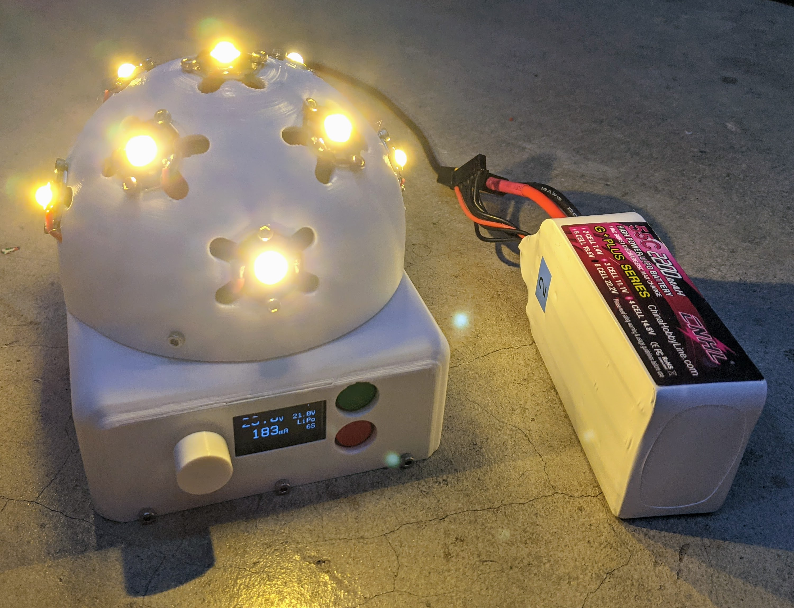
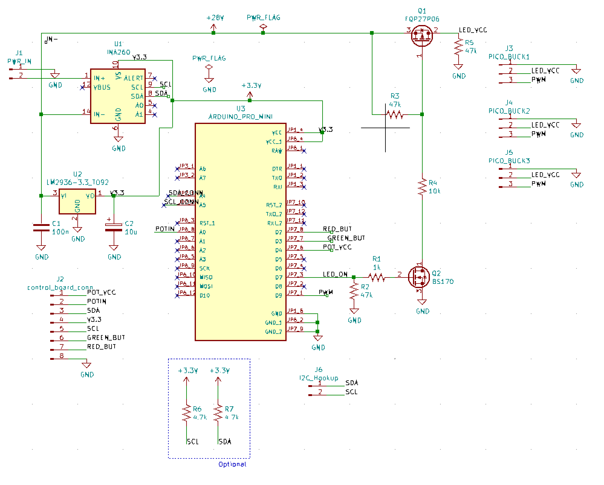
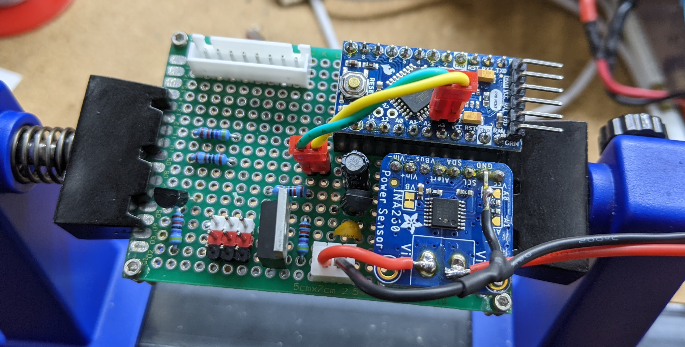
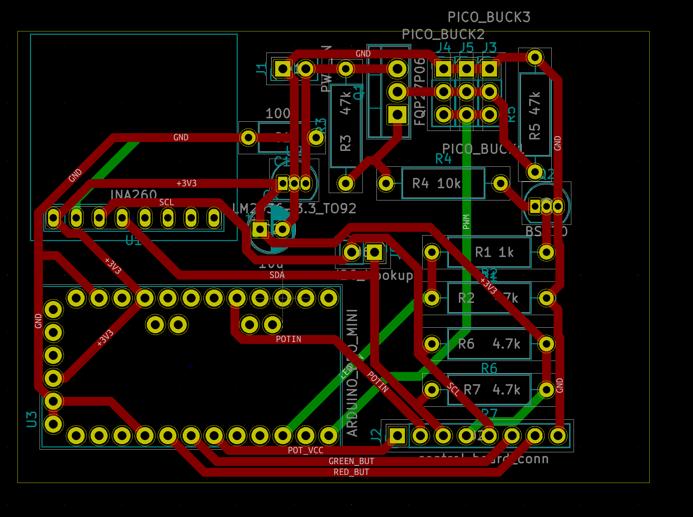
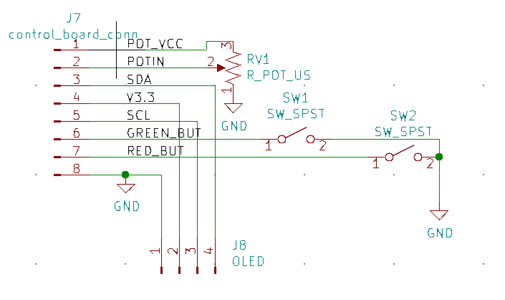
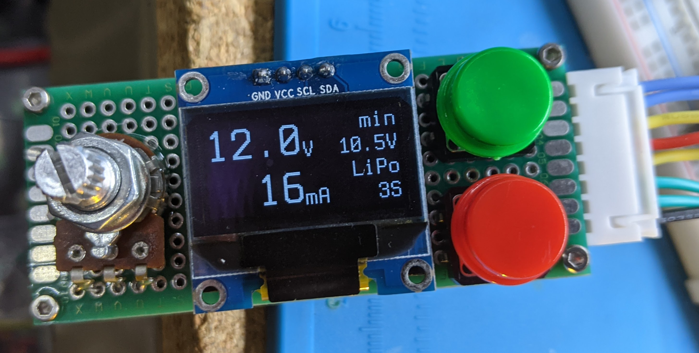
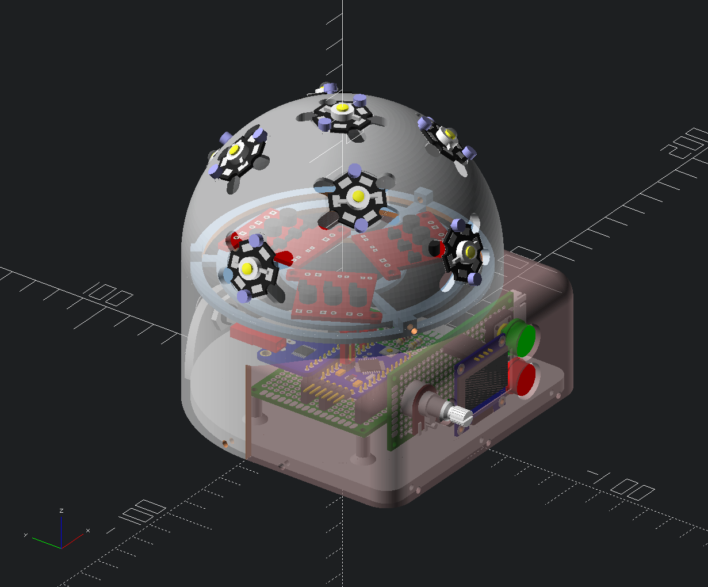

# Emergency LED Lamp

*The page (TODO) and pdf file (TODO) contain detailed build instructions, a
prebuilt firmware (`led_lamp.hex`) file and prerendered `.stl` files.  The rest
of the instructions on this page to give some quick details on project and to
explain how to build your own firmware.*

If you suddenly lose power, it's nice to have an efficient light that can
accept a wide variety of batteries. This page shows a way to **build such an
emergency LED lamp**. Of course, the lamp could also be used anywhere you want a
portable ambient light.

The lamp can accept a wide range of voltages - between 6 and 30V. This allows
it to be **used with different batteries you may have lying around**, including
18650 packs, RC batteries, 12V lead acid, etc.

The unit is designed to be **very efficient** and puts out very little heat, even
at full power. A dimmer knob can be used to adjust the power consumption and
light output. When "off" the lamp consumes less than 40 uA of power in its
"sleep" state.

**Voltage and current are monitored on a small OLED display**. This allows you to
estimate battery life at a given light level and make adjustments as needed for
your situation.

The device has **automatic shutoff when the battery voltage gets too low**.

The device can autodetect the battery you are using with options for manual
override.

Before we get too far, a **disclaimer**:

**Using batteries carries a risk**. Making mistakes can lead to batteries catching
on fire. Sometimes batteries catch on fire even when everything is done
correctly due to unknown issues during manufacturing or shipping. It is
expected that you understand the risks associated with the battery you choose.
Even though the hardware and software in on this page have been tested, you
should not assume that your build and batteries will operate without problems.
I take no responsibility for issues you may encounter while following this
guide or using the provided software. Using a safety container for your battery
is recommended.

# Project Overview

This project contains:

  * Firmware in the `firmware/` directory.  This firmware is intended for the
    ATMega328p running at 3.3v and 8Mhz.  A 3.3V Arduino Pro Mini meets these specs
  * A [KiCad](https://www.kicad.org/) schematic and PCB layout in the
    `schematic/` directory
  * An [OpenSCAD](https://openscad.org/) 3D printable enclosure in the
    `3d_print/` directory.

# Schematics and Images

You'll want the free KiCAD tool to work on the schematics.  The images below are
screen captures from KiCAD for quick reference.

#### Master Board Schematic

#### Input Board Schematic

# Building the firmware

You will need the following commandline tools available.  All are free tools.
Getting them will vary depending on your operating system.

  * `avr-gcc`
  * `avr-objcopy`
  * `avrdude`

To build you run

    make

from the `firmware/` directory.  To upload to a ATMega328p (pro mini) you run

    make upload

Note that upload is currently not setup for windows, although it could be made
to work with a few tweaks to the relatively-simple `rules.mak` file.  The main
issue is likely to be incorrect `avrdude` parameters.  See the main `avrdude`
documentation for for more information.

# OpenSCAD

The file `3d_print/led_lamp.scad` contains the 3D models.

At the bottom of the file is a section:

    placed_master_pcb();
    placed_input_pcb();
    placed_picobuck_mount_plate(add_picobucks=true);
    placed_barrel_connector();
    lamp_base();
    placed_led_dome(show_leds=true, barrel_connector_cutout=true);
    input_holder();
    placed_dimmer_knob();

You can place a `*` character or comment out a line with a `//` to omit the
part.  You can also prefix a line with `!` to only show that part.  This is
useful for isolating a part for making a `.stl` model for printing.
